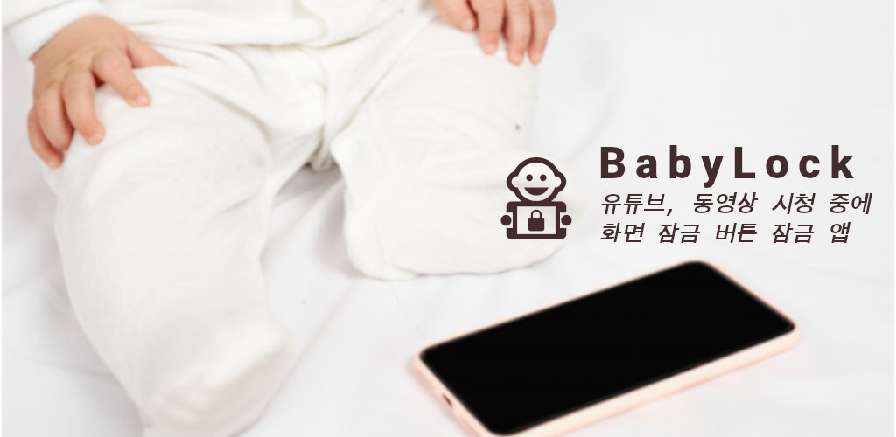
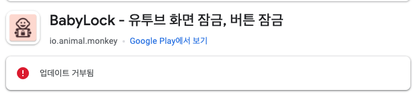

## DCCafe 사용자 Half-Auto 업데이트
- https://github.com/sh0seo/go-user-update
- Golang과 Github Action을 이용하여 사용자 정보 갱신을 DB 쿼리가 아닌 golang 코드로
- `golang`

BabyLock App은 안드로이드에서 화면터치, 버튼(홈, 메뉴, 뒤로가기)을 방지합니다. 아기들이 Youtube, 동영상 시청 중에 화면이 터치되거나 홈버튼 누르는 것을 방지하는 App입니다. 

## 결과

2달 정도 개발 진행을 했고 Play Store에 업로드하고 얼마 후에 Reject!. Apple도 아니고 왠 리젝?? https://sh0seo.github.io/img/

## Github에 공유

나중에 Play Store 정책이 변경되서 올릴수 있는 날이오면 이어서 해보자.

https://github.com/sh0seo/BabyLock 